<p align='center'>
    
</p>

<p align="center">    
  <a href="#demo">
    
  </a>
  <a href="https://capsule-render.vercel.app/">
    
  </a>
  <br/>
  <a href="https://github.com/kyechan99/capsule-render/graphs/contributors">
    
  </a>
  <a href="https://codecov.io/gh/kyechan99/capsule-render">
    
  </a>
  <a href="https://github.com/kyechan99/capsule-render/issues">
    
  </a>
  <a href="https://github.com/kyechan99/capsule-render/pulls">
    
  </a>
</p>

<p align="center"> 
  <a href="README.md">English</a> 
  ·
  <a href="/docs/README_kr.md">한국어</a> 
  ·
  <a href="/docs/README_es.md">Español</a>
  ·
  <a href="/docs/README_fr.md">Français</a>
  ·
  <a href="/docs/README_de.md">Deutsch</a>
  <br/>
  <a href="/docs/README_zh-cn.md">简体中文</a>  
  ·
  <a href="/docs/README_zh-tw.md">繁體中文</a>
  ·
  <a href="/docs/README_zh-hk.md">繁體粤语</a>
  ·
  <a href="/docs/README_pt-br.md">Português (Brasileiro)</a>
  ·
  <a href="/docs/README_jp.md">日本語</a>
  ·
  <a href="/docs/README_ml.md">മലയാളം</a>
  ·
  <a href="/docs/README_ru.md">Русский</a>

</p>
<br/>

> [!TIP]
> ലളിതമായ [Generator](https://capsule-render.vercel.app/) പിന്തുണയ്ക്കുന്നു.  
> എന്നാൽ കൂടുതൽ വിശദമായ ക്രമീകരണങ്ങൾക്ക് README വായിക്കാൻ ശുപാർശ ചെയ്യുന്നു.

> [!IMPORTANT]
> This service is provided on a best-effort basis and may be unstable due to usage limits or traffic spikes.
>
> For reliable use, please [fork](https://github.com/kyechan99/capsule-render/fork) the repository and deploy it to your own [Vercel instance](https://vercel.com/new) (or another hosting platform).

## Navigation (നാവിഗേഷൻ)

1. [എങ്ങനെ ഉപയോഗിക്കാം (How To Use)](#how-to-use)
2. [ടൈപ്പുകൾ](#types)
3. [നിറം](#color)
4. [കസ്റ്റം കളർ ലിസ്റ്റ്](#custom-color-list)
5. [Theme (തീം)](#theme-തീം)
6. [വിഭാഗം](#section)
7. [റിവേഴ്സൽ](#reversal)
8. [ഉയരം](#height)
9. [ടെക്സ്റ്റ്](#text)
10. [വിവരണം (Desc)](#desc)
11. [ടെക്സ്റ്റ് ബാക്ക്ഗ്രൗണ്ട്](#text-background)
12. [ടെക്സ്റ്റ് അനിമേഷൻ](#text-animation)
13. [ഫോണ്ട് നിറം](#fontcolor)
14. [FontFamily](#fontfamily)
15. [ഫോണ്ട് വലുപ്പം](#fontsize)
16. [ഫോണ്ട് അലൈന്മെന്റ് - X](#fontalign)
17. [ഫോണ്ട് അലൈന്മെന്റ് - Y](#fontaligny)
18. [വിവരണ വലുപ്പം](#descsize)
19. [വിവരണ അലൈന്മെന്റ് - X](#descalign)
20. [വിവരണ അലൈന്മെന്റ് - Y](#descaligny)
21. [റൊട്ടേറ്റ്](#rotate)
22. [Stroke](#stroke)
23. [Stroke-width](#stroke-width)
24. [ഡെമോ](#demo)

Idea സംബന്ധിച്ച ഏതെങ്കിലും നിർദ്ദേശങ്ങൾ → [Idea-Issue](https://github.com/kyechan99/capsule-render/labels/Idea) അല്ലെങ്കിൽ [PR](https://github.com/kyechan99/capsule-render/pulls)

## എങ്ങനെ ഉപയോഗിക്കാം (How To Use) <a id="how-to-use"></a>

```
https://capsule-render.vercel.app/api?
```

ഈ URL-ന്റെ അവസാനം query parameter ചേർത്താൽ മതി. ഉദാഹരണത്തിന്:

Markdown:

```

```

HTML:

```

```

## Types (ടൈപ്പുകൾ) <a id="types"></a>

Type ഉപയോഗിച്ച് ബാക്ക്ഗ്രൗണ്ട് ഇമേജ് മാറ്റാം.

- [wave](#wave) : ഡിഫോൾട്ട്
- [egg](#egg)
- [shark](#shark)
- [slice](#slice)
- [rect](#rect)
- [soft](#soft)
- [rounded](#rounded)
- [cylinder](#cylinder)
- [waving](#waving)
- [venom](#venom)
- [speech](#speech)
- [blur](#blur)
- [transparent](#transparent)

URL-ൽ `&type=` ചേർക്കുക:

```

```

## Color (നിറം) <a id="color"></a>

ബാക്ക്ഗ്രൗണ്ട് ഇമേജ് നിറം മാറ്റാം!

- `&color=auto` : റാൻഡം നിറം (ലിസ്റ്റ് [ഇവിടെ](https://github.com/kyechan99/capsule-render/blob/master/src/pallete.json))
- `&color=timeAuto` : സമയം അടിസ്ഥാനമാക്കി റാൻഡം നിറം
- `&color=random` : പൂർണ്ണമായും റാൻഡം നിറം
- `&color=gradient` : റാൻഡം ഗ്രേഡിയന്റ് (ലിസ്റ്റ് [ഇവിടെ](https://github.com/kyechan99/capsule-render/blob/master/src/gradient.json))
- `&color=timeGradient` : സമയം അടിസ്ഥാനമാക്കിയുള്ള ഗ്രേഡിയന്റ്
- `&color=_hexcode` : ഡിഫോൾട്ട് (#B897FF)
- `&color=_custom_gradient` : കസ്റ്റം ഗ്രേഡിയന്റ്  
  ഉദാ: `&color=0:EEFF00,100:a82da8`

`auto` ഉപയോഗിക്കുമ്പോൾ `fontColor` മാറ്റേണ്ടതില്ല.

```

```

> സ്റ്റാറ്റിക് നിറം ഉപയോഗിക്കുമ്പോൾ '#' എഴുതരുത്.

> `timeAuto` & `timeGradient` ഒരേസമയം header + footer ഉപയോഗിക്കുമ്പോൾ.

## Custom Color List (കസ്റ്റം കളർ ലിസ്റ്റ്) <a id="custom-color-list"></a>

`&color=auto` അല്ലെങ്കിൽ `&color=gradient` ഉപയോഗിക്കുമ്പോൾ **റാൻഡം നിറങ്ങളുടെ ലിസ്റ്റ് നിങ്ങൾക്ക് കസ്റ്റമൈസ് ചെയ്യാം**.

URL-ൽ `&customColorList=` ചേർക്കുക.

ഉദാഹരണം:

```

```

## Theme (തീം)

`theme=` ഉപയോഗിച്ച് മുൻകൂട്ടി നിർവചിച്ച കളർ കോമ്പിനേഷൻ ഉപയോഗിക്കാം.

`color` & `fontColor` ഉപയോഗിച്ചാലും theme-ന് മുൻഗണന.

ലിസ്റ്റ്: [pallete_theme.json](https://github.com/kyechan99/capsule-render/blob/master/src/pallete_theme.json)

```

```

## Section (വിഭാഗം) <a id="section"></a>

ബാക്ക്ഗ്രൗണ്ട് ഇമേജ് മറിച്ചിടാൻ ഉപയോഗിക്കുന്നു.

- `&section=header` : ഡിഫോൾട്ട്
- `&section=footer`

```

```

---

## Reversal (റിവേഴ്സൽ) <a id="reversal"></a>

ചിത്രം ഇടത്തോട്ടും വലത്തോട്ടും മറിക്കുക. (നിറവും ഒരേസമയം മാറും)

- `&reversal=false` : (default)
- `&reversal=true`

```

```

## Height (ഉയരം) <a id="height"></a>

ചിത്രത്തിന്റെ വലുപ്പം മാറ്റുക. ഡിഫോൾട്ട് മൂല്യം 120 ആണ്.

URL-ൽ `&height= ` എഴുതുക

```

```

> `px` എഴുതരുത്

## Text (ടെക്സ്റ്റ്) <a id="text"></a>

ചിത്രത്തിന്മുകളിൽ ടെക്സ്റ്റ് ചേർക്കുക.

`&text= ` ഉപയോഗിച്ച് എന്തെങ്കിലും എഴുതുക.

```

```

> ചില പ്രത്യേക പ്രതീകങ്ങൾ ഉപയോഗിക്കാൻ പറ്റില്ല. ഉദാ: '#', '&', '/' ...
>
> API കുഴങ്ങാൻ ഇടയാകും

> `%20` (സ്പേസ്)യും `-nl-` (പുതിയ വരി)യും മാത്രം ഉപയോഗിക്കുന്നത് ശുപാർശ ചെയ്യുന്നു

## Desc (വിവരണം) <a id="desc"></a>

ചിത്രത്തിന്മുകളിൽ വിവരണം (desc) ചേർക്കുക.

`&desc= ` ഉപയോഗിച്ച് എന്തെങ്കിലും എഴുതുക.

```

```

> ചില പ്രത്യേക പ്രതീകങ്ങൾ ഉപയോഗിക്കാൻ പറ്റില്ല. ഉദാ: '#', '&', '/' ...
>
> API കുഴങ്ങാൻ ഇടയാകും

> `%20` (സ്പേസ്)യും `-nl-` (പുതിയ വരി)യും മാത്രം ഉപയോഗിക്കുന്നത് ശുപാർശ ചെയ്യുന്നു

## Text Background (ടെക്സ്റ്റ് ബാക്ക്ഗ്രൗണ്ട്) <a id="text-background"></a>

ടെക്സ്റ്റിന്റെ പശ്ചാത്തലം.

സജീവമാക്കാൻ `&textBg=true` എഴുതുക.

> പശ്ചാത്തല വലുപ്പം കൂട്ടണമെങ്കിൽ,
> ടെക്സ്റ്റ് മൂല്യങ്ങൾക്കിടയിൽ `%20` ചേർക്കുക.
> കാരണം പശ്ചാത്തല വലുപ്പം ഇംഗ്ലീഷ് ടെക്സ്റ്റിന്റെ നീളത്തെ ആശ്രയിച്ചിരിക്കുന്നു. (%20 = സ്പേസ്)

```

```

## Text Animation (ടെക്സ്റ്റ് അനിമേഷൻ) <a id="text-animation"></a>

ടെക്സ്റ്റ് ഡൈനാമിക് ആക്കുക.

ഉപയോഗിക്കണമെങ്കിൽ `&animation= ` എഴുതുക.

- `fadeIn` : fadeIn 1.2s
- `scaleIn` : scaleIn .8s
- `blink` : blink .6s
- `blinking` : blinking 1.6s
- `twinkling` : twinkling 4s

```

```

## FontColor (ഫോണ്ട് നിറം) <a id="fontcolor"></a>

ടെക്സ്റ്റിന്റെ നിറം മാറ്റുക. ഡിഫോൾട്ട് മൂല്യം 000000.

മൂല്യം '#' ഇല്ലാത്ത Hex കോഡ് ആയിരിക്കണം.

**Text** query-ന്റെ പിന്നാലെ `&fontColor= ` എഴുതുക.

```

```

## FontFamily

Change text font family.

Write `&fontFamily= ` behind **Text** query.

Use `%20` for spaces in font names.

> `fontFamily` is applied as CSS `font-family`, but actual rendering depends on fonts available in the rendering environment. If a font is unavailable, fallback fonts are used.

```

```

## FontSize (ഫോണ്ട് വലുപ്പം) <a id="fontsize"></a>

ടെക്സ്റ്റിന്റെ ഫോണ്ട് വലുപ്പം മാറ്റുക. ഡിഫോൾട്ട് മൂല്യം 70.

**Text** query-ന്റെ പിന്നാലെ `&fontSize= ` എഴുതുക.

```

```

> `px` എഴുതരുത്

## FontAlign (ഫോണ്ട് അലൈന്മെന്റ് - X) <a id="fontalign"></a>

ടെക്സ്റ്റിന്റെ horizontal-align (x) മാറ്റുക. **0 മുതൽ 100 വരെ** ഒരു സംഖ്യ എഴുതുക.

`&fontAlign= ` : ഡിഫോൾട്ട് മൂല്യം 50 (ചിത്രത്തിന്റെ മധ്യം)

> `&text= `-ൽ (`-nl-`) ഒന്നിലധികം വരികൾ ഉണ്ടെങ്കിൽ,
> ഒന്നിലധികം `&fontAlign= ` നൽകിയാൽ ഓരോ വരിക്കും വ്യത്യസ്ത alignment ലഭിക്കും.

```

```

## FontAlignY (ഫോണ്ട് അലൈന്മെന്റ് - Y) <a id="fontaligny"></a>

ടെക്സ്റ്റിന്റെ vertical-align (y) മാറ്റുക. **0 മുതൽ 100 വരെ** ഒരു സംഖ്യ എഴുതുക.

`&fontAlignY= ` : ഒരു വരിക്ക് ഡിഫോൾട്ട് മൂല്യം 50 (ചിത്രത്തിന്റെ മധ്യം).  
ഒന്നിലധികം വരികൾ ഉണ്ടെങ്കിൽ അവയെ മധ്യത്തിൽ നിരത്താൻ സ്വയം കണക്കാക്കും.

> ഒന്നിലധികം വരികൾ ഉണ്ടെങ്കിൽ,
> ഒന്നിലധികം `&fontAlignY= ` നൽകിയാൽ ഓരോ വരിക്കും വ്യത്യസ്ത alignment ലഭിക്കും.

```

```

## DescSize (വിവരണ വലുപ്പം) <a id="descsize"></a>

വിവരണത്തിന്റെ ഫോണ്ട് വലുപ്പം മാറ്റുക. ഡിഫോൾട്ട് മൂല്യം 20.

**desc** query-ന്റെ പിന്നാലെ `&descSize= ` എഴുതുക.

```

```

> `px` എഴുതരുത്

## DescAlign (വിവരണ അലൈന്മെന്റ് - X) <a id="descalign"></a>

വിവരണത്തിന്റെ horizontal-align (x) മാറ്റുക. **0 മുതൽ 100 വരെ** ഒരു സംഖ്യ എഴുതുക.

`&descAlign= ` : ഡിഫോൾട്ട് മൂല്യം 50 (ചിത്രത്തിന്റെ മധ്യം)

```

```

## DescAlignY (വിവരണ അലൈന്മെന്റ് - Y) <a id="descaligny"></a>

വിവരണത്തിന്റെ vertical-align (y) മാറ്റുക. **0 മുതൽ 100 വരെ** ഒരു സംഖ്യ എഴുതുക.

`&descAlignY= ` : ഡിഫോൾട്ട് മൂല്യം 60 (ചിത്രത്തിന്റെ മധ്യം)

```

```

## Rotate (റൊട്ടേറ്റ്) <a id="rotate"></a>

ടെക്സ്റ്റ് തിരിക്കാൻ `&rotate= ` ഉപയോഗിക്കുക.

നെഗറ്റീവ് സംഖ്യകളും ഉപയോഗിക്കാം.

> ശുപാർശ ചെയ്യുന്ന പരിധി: `0 ~ 360`, `0 ~ -360`.

```

```

## Stroke

ടെക്സ്റ്റിന്റെ stroke മാറ്റുക.

query-ന്റെ പിന്നാലെ `&stroke=` എഴുതുക.

മൂല്യം '#' ഇല്ലാത്ത Hex കോഡ് ആയിരിക്കണം.

```

```

> `strokeWidth` ഉപയോഗിച്ച് ചേർത്താൽ കൂടുതൽ നല്ലത്.
>
> ഒറ്റയ്ക്ക് ഉപയോഗിച്ചാൽ strokeWidth ഡിഫോൾട്ട് മൂല്യം 1.

## Stroke-width

ടെക്സ്റ്റിന്റെ stroke വീതി മാറ്റുക.

stroke query-ന്റെ പിന്നാലെ `&strokeWidth=` എഴുതുക.

മൂല്യം 0 അല്ലെങ്കിൽ അതിൽ കൂടുതലായിരിക്കണം.

```

```

> `stroke` ഉപയോഗിച്ച് ചേർത്താൽ കൂടുതൽ നല്ലത്.
>
> ഒറ്റയ്ക്ക് ഉപയോഗിച്ചാൽ stroke ഡിഫോൾട്ട് മൂല്യം 'B897FF'.

---

## Demo (ഡെമോ) <a id="demo"></a>

## Wave <a id="wave">

[](https://capsule-render.vercel.app/api?type=wave&color=auto&height=200&text=WAVE)

## Egg <a id="egg">

[](https://capsule-render.vercel.app/api?type=egg&color=auto&height=210)

## Shark <a id="shark">

[](https://capsule-render.vercel.app/api?type=shark&color=gradient&height=140)

## Slice <a id="slice">

[](https://capsule-render.vercel.app/api?type=slice&color=auto&height=200&text=SLICE&fontAlign=70&rotate=13&fontAlignY=25&desc=desc%20function%20is%20also%20rotated.&descAlign=60&descAlignY=44)

## Rect <a id="rect">

[](https://capsule-render.vercel.app/api?type=rect&color=gradient&text=%20%20RECT%20%20&fontAlign=30&fontSize=30&textBg=true&desc=Use%20%27textBg%27%20to%20highlight%20%27text%27&descAlign=60&descAlignY=50)

## Soft <a id="soft">

[](https://capsule-render.vercel.app/api?type=soft&color=auto&text=Good%20to%20use%20with%20other%20readme&fontSize=40&animation=twinkling)

## Rounded <a id="rounded">

[](https://capsule-render.vercel.app/api?type=rounded&color=timeAuto&text=Rounded%20with%20stroke&fontAlignY=50&fontSize=40&height=200&stroke=000000&strokeWidth=2)

## Cylinder <a id="cylinder">

[](https://capsule-render.vercel.app/api?type=cylinder&color=auto&text=Cylinder&fontAlignY=45&fontSize=40&height=150&animation=blinking&desc=desc%20is%20also%20animated&descAlignY=70)

## Waving <a id="waving">

[](https://capsule-render.vercel.app/api?type=waving&height=200&text=Waving!&fontAlign=80&fontAlignY=40&color=gradient)

## Transparent <a id="transparent">

[](https://capsule-render.vercel.app/api?type=transparent&fontColor=703ee5&text=Transparent&height=150&fontSize=60&desc=Only%20Use%20Text&descAlignY=75&descAlign=60)

## Venom <a id="venom">

[](https://capsule-render.vercel.app/api?type=venom&height=200&text=I%20am%20Venom.&fontSize=70&color=0:8871e5,100:b678c4&stroke=b678c4)

## Speech <a id="speech">

[](https://capsule-render.vercel.app/api?type=speech&height=200&fontSize=45&color=gradient&text=speech-nl-bubble&animation=blinking&fontAlign=30,60&fontAlignY=35,55)

## Blur <a id="blur">

[](https://capsule-render.vercel.app/api?type=blur&height=300&color=gradient&text=Blur&strokeWidth=2&section=footer&reversal=true&fontAlign=50&stroke=E0E0E0&fontSize=55&textBg=false)

<hr/>
